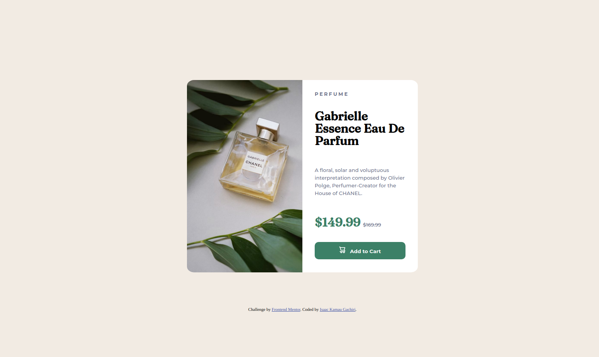

# Frontend Mentor - Product preview card component solution

This is a solution to the [Product preview card component challenge on Frontend Mentor](https://www.frontendmentor.io/challenges/product-preview-card-component-GO7UmttRfa). Frontend Mentor challenges help you improve your coding skills by building realistic projects.

## Table of contents

- [Overview](#overview)
  - [The challenge](#the-challenge)
  - [Screenshot](#screenshot)
  - [Links](#links)
- [My process](#my-process)
  - [Built with](#built-with)
  - [What I learned](#what-i-learned)
  - [Continued development](#continued-development)
  - [Useful resources](#useful-resources)
- [Author](#author)
- [Acknowledgments](#acknowledgments)

**Note: Delete this note and update the table of contents based on what sections you keep.**

## Overview

### The challenge

Users should be able to:

- View the optimal layout depending on their device's screen size
- See hover and focus states for interactive elements

### Screenshot

<em><b>Mobile Design</em></b>

  

<em><b>Desktop Design</b></em>

### Links

- Solution URL: [Github](https://github.com/retop56/FrontendMentor---Product-preview-card-component)
- Live Site URL: [Result](https://retop56.github.io/FrontendMentor---Product-preview-card-component/)

## My process

### Built with

- Semantic HTML5 markup
- CSS custom properties
- Flexbox

### What I learned

- How to use media queries to change design elements in CSS based on the width of the device viewport.

- How to debug the page using Chrome Developer Tools

- How to position a background image in CSS

- How to use CSS custom variables

- How to not lose it when I'm stuck on a certain part (take a break!!!)

### Continued development

Need to get more comfortable with Flexbox. I don't have a firm enough grasph on it yet, but I know with more effort I'll get there.

## Acknowledgments

Shoutout to Frontend Mentor for providing this great project!
